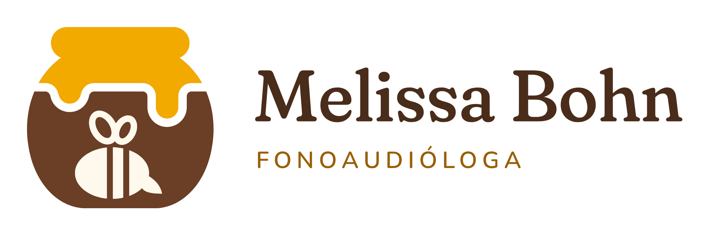
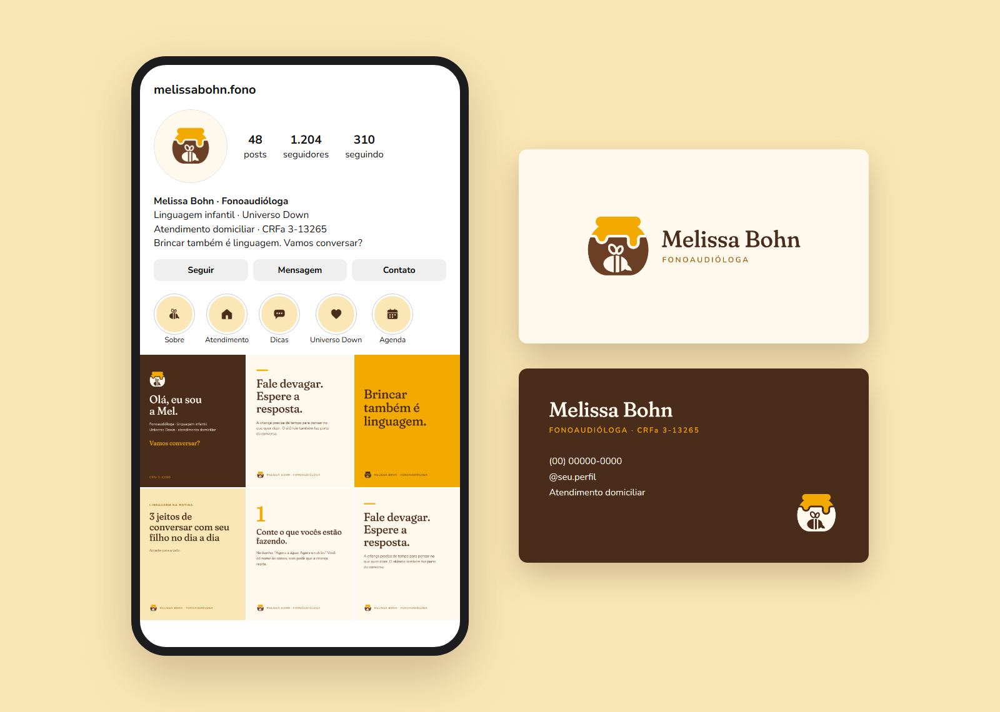

  

# Marca Melissa Bohn · Fonoaudióloga

Identidade visual da Melissa Bohn, fonoaudióloga (CRFa 3-13265), com foco em linguagem infantil, atuação no Universo Down e atendimento domiciliar.

**Guia da marca online:** https://gabrielwalendolf.github.io/marca-melissa-bohn/

## O símbolo

Mel é o apelido da Melissa. O símbolo é um pote de mel com o mel escorrendo pela borda e uma abelha na barriga do pote. O corpo da abelha tem a forma de um balão de fala, e o ferrão é a pontinha do balão. Melissa vem do grego *mélissa*, que quer dizer abelha.

  

## Cores

| Cor | HEX | RGB | CMYK | Uso |
|---|---|---|---|---|
| Mel | `#F2A900` | 242 · 169 · 0 | 0 · 30 · 100 · 5 | Cor principal, destaques |
| Mel queimado | `#9A5F06` | 154 · 95 · 6 | 0 · 38 · 96 · 40 | Textos de apoio em fundo claro |
| Pote | `#6B3E26` | 107 · 62 · 38 | 0 · 42 · 64 · 58 | Pote do símbolo, textos |
| Café | `#4A2C1A` | 74 · 44 · 26 | 0 · 41 · 65 · 71 | Títulos e fundo escuro |
| Favo | `#FBE7B5` | 251 · 231 · 181 | 0 · 8 · 28 · 2 | Fundo de apoio |
| Creme | `#FFF8EC` | 255 · 248 · 236 | 0 · 3 · 7 · 0 | Fundo principal |

Os valores CMYK são uma conversão de referência. Para impressão, peça uma prova de cor à gráfica.

## Fontes

- **Fraunces** para títulos, frases e o nome.
- **Nunito** para textos e etiquetas.

As duas são gratuitas (SIL Open Font License), estão no Google Fonts e no Canva, e os arquivos estão em [`02-kit/fontes`](02-kit/fontes).

## Onde está cada arquivo

| Pasta | Conteúdo |
|---|---|
| [`02-kit/logo/svg`](02-kit/logo/svg) | Logos em vetor (para gráfica e edição) |
| [`02-kit/logo/png`](02-kit/logo/png) | Logos em imagem com fundo transparente |
| [`02-kit/instagram`](02-kit/instagram) | Foto de perfil, capas de destaque e modelos de post |
| [`02-kit/papelaria`](02-kit/papelaria) | Cartão de visita, frente e verso |
| [`02-kit/icones/web`](02-kit/icones/web) | Favicon e ícones para site |
| [`02-kit/fontes`](02-kit/fontes) | Fraunces e Nunito |
| [`02-kit/guia`](02-kit/guia) | Guia da marca |
| [`01-conceitos`](01-conceitos) | Estudos e conceitos apresentados antes da versão final |

Cada logo existe nas versões **colorida** (fundos claros), **negativa** (fundo café), **café** (sobre o mel), **preta** e **branca** (impressão em uma cor e gravação). Abaixo de 32 px, use o **símbolo reduzido**, sem a abelha.

Para baixar tudo de uma vez: botão verde **Code**, depois **Download ZIP**.

## Pendências

- Telefone e @ do Instagram no verso do cartão estão provisórios.
- Textos dos posts e nomes dos destaques são exemplos, para ajustar com os pilares de conteúdo.
- Antes de registrar a marca, fazer uma busca no INPI.

---

© 2026 Melissa Bohn. O logo e a identidade visual são de uso exclusivo da marca e não estão liberados para reutilização. As fontes seguem suas próprias licenças (OFL), incluídas na pasta de fontes.
